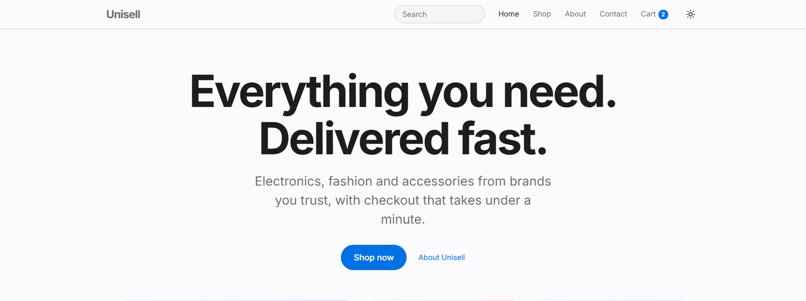
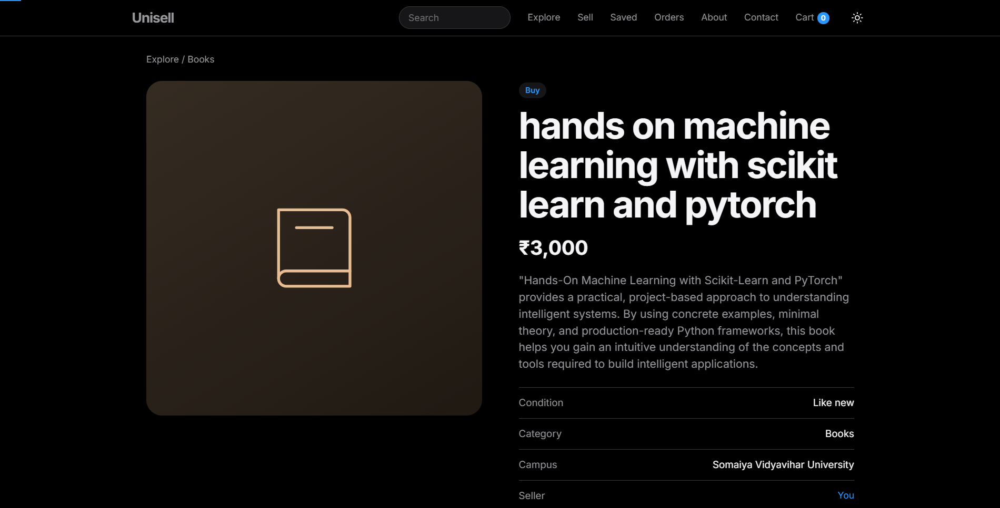
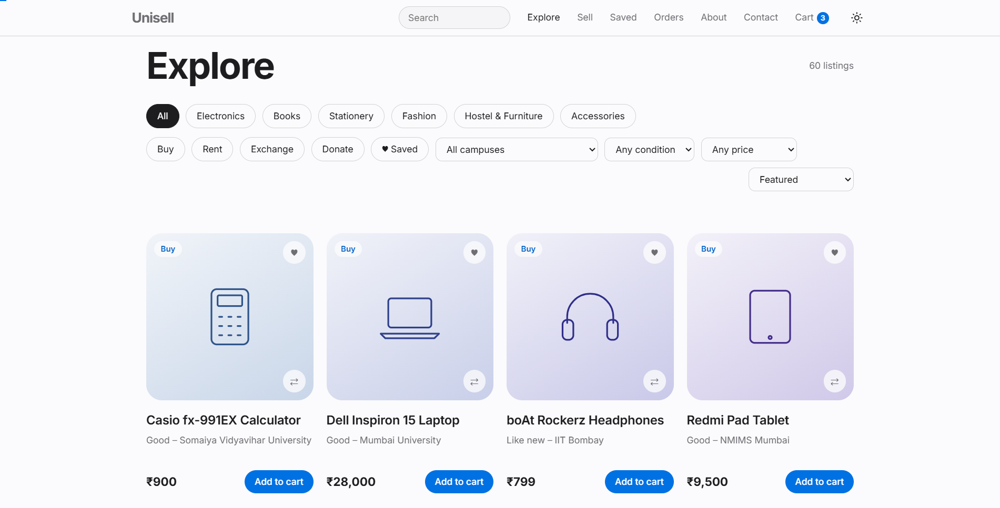
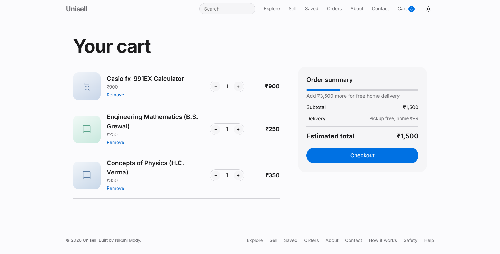

# UNISELL 2.0 🎓

A student marketplace where university communities can buy, sell, rent, exchange and donate products. Built using HTML, CSS, and JavaScript featuring a 60-listing catalog, smart search, a step-by-step sell flow, seller profiles, wishlist, cart management, checkout simulation, orders, dark mode support, and analytics integration.

> **One Market. Unlimited Selling.**

## 🌐 Live Demo

https://nikunjmody05.github.io/UNISELL/

---

## ✨ Features

* Marketplace Catalog (60 sample listings across 6 categories)
* Buy, Rent, Exchange and Donate listing types
* Explore Page with Filters (Category, Type, Campus, Condition, Max Price)
* Sorting (Featured, Newest, Price Low to High, Price High to Low)
* Smart Search that understands queries like "used calculator under ₹1500"
* Product Pages that adapt to the listing type (rental price per day and deposit, exchange wishes, free donations)
* Sell Flow: 5-step listing form that publishes into Explore
* Seller Profiles and a Your Listings page with Unlist
* Wishlist Page
* Shopping Cart with Quantity Controls and Rental Items
* Free Delivery Progress Bar
* Full Checkout Flow with UPI and Card Payment Simulation
* Order Confirmation with Transaction ID
* Orders Page with Order History
* Contact Form with Validation
* Dark / Light Theme
* Responsive Design
* Google Analytics 4 and Microsoft Clarity Integration

---

## 🛠 Tech Stack

* HTML5
* CSS3
* JavaScript (ES6)
* Local Storage (data layer)
* Google Analytics 4
* Microsoft Clarity
* Smartlook
* Contentsquare
* GitHub Pages

---

## 📁 Project Structure

```
UNISELL/
├── index.html
├── products.html     (Explore)
├── product.html      (Listing page)
├── sell.html         (Sell flow)
├── seller.html       (Seller profile / Your listings)
├── wishlist.html
├── cart.html         (Cart and checkout)
├── orders.html
├── about.html
├── contact.html
├── style.css
├── app.js
├── analytics.js
├── README.md
└── screenshots/
```

---

## 📊 Analytics Events

The project tracks user interactions using Google Analytics 4.

| Event             | Description                           |
| ----------------- | ------------------------------------- |
| view_item         | User opens a listing                  |
| search            | User searches the marketplace         |
| add_to_cart       | User adds a product                   |
| add_to_wishlist   | User saves a product                  |
| rent_product      | User rents a product                  |
| exchange_request  | User requests an exchange             |
| donation_request  | User requests a donated item          |
| create_listing    | User publishes a listing              |
| begin_checkout    | Checkout process started              |
| add_payment_info  | Payment method selected and valid     |
| purchase          | Order successfully completed          |
| generate_lead     | Contact form submitted                |

---

## 🔒 What Is Real and What Is Simulated

UNISELL 2.0 is a front-end application. It is honest about its limits:

* Listings, sellers and campuses in the catalog are **sample data**
* Your own listings, cart, wishlist, orders and theme are saved in **Local Storage** on your device only
* Payments are **simulated**. No money is processed, so do not enter real card details
* Exchange and donation requests show a confirmation but are not delivered to anyone yet
* There are no accounts, reviews or university verification yet

---

## 🗺 Roadmap (Stage 2)

* Accounts and university email verification
* Real database and image storage
* Buyer and seller chat
* Real payments with a server-side integration
* Reviews tied to completed transactions
* Admin moderation
* AI-powered search and recommendations

---

## 🚀 Installation

Clone the repository:

```bash
git clone https://github.com/nikunjmody05/UNISELL.git
```

Open:

```bash
index.html
```

in your browser.

---

## 📷 Screenshots

### Homepage



### Dark Mode



### Explore Page



### Cart & Checkout Page



---

## 👨‍💻 Author

Nikunj Mody

GitHub:
https://github.com/nikunjmody05

---

## 📄 License

This project was developed for educational and portfolio purposes.
