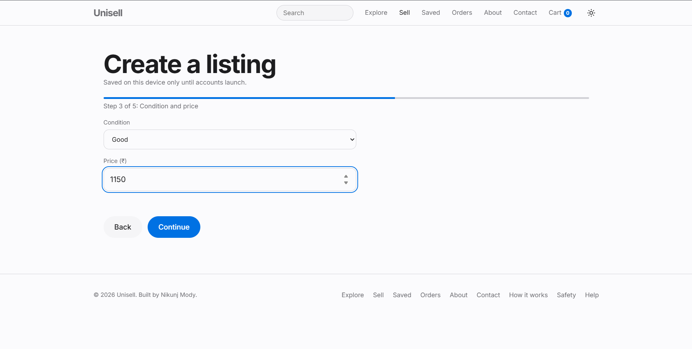
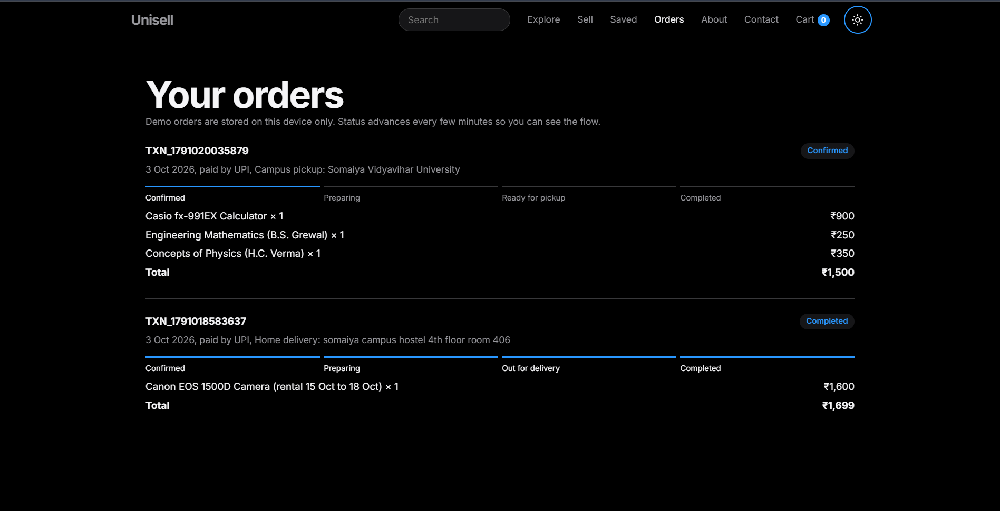

# UNISELL 🎓

A student marketplace where university communities can buy, sell, rent, exchange and donate products. Built using HTML, CSS, and JavaScript featuring a 60-listing catalog, smart search, a step-by-step sell flow, rental booking with double-booking prevention, pickup or delivery checkout, order tracking, compare, recommendations, dark mode support, and analytics integration.

> **One Market. Unlimited Selling.**

## 🌐 Live Demo

https://nikunjmody05.github.io/UNISELL/

---

## ✨ Features

**Marketplace**
* 60 sample listings across 6 categories (Electronics, Books, Stationery, Fashion, Hostel & Furniture, Accessories)
* Buy, Rent, Exchange and Donate listing types, with product pages that adapt to the type
* Explore page with filters (Category, Type, Campus, Condition, Max Price) and sorting
* Smart Search that understands queries like "used calculator under ₹1500" (rule-based, not AI)
* Compare up to 3 listings side by side
* Similar listings, Recently viewed and Recommended for you (rule-based, from your activity)

**Selling**
* 5-step Sell flow that publishes into Explore
* Edit and unlist your own listings
* Seller profiles and a Your Listings page

**Buying**
* Wishlist page and shopping cart with quantity controls
* Rental booking with date picker and double-booking prevention
* Checkout with campus pickup (free) or home delivery, plus UPI and card payment simulation
* Order confirmation with Transaction ID
* Orders page with a status tracker (Confirmed, Preparing, Ready or Out for delivery, Completed)

**Experience**
* Dark / Light theme with no flash on load
* Responsive design with a mobile menu
* Scroll animations with reduced-motion support
* Accessibility: skip link, labelled landmarks, keyboard focus, screen-reader state for buttons
* SEO: page descriptions, canonical links, link previews, sitemap, custom 404 page
* How it works, Trust and Safety, and Help/FAQ pages
* Google Analytics 4 and Microsoft Clarity integration

---

## 🛠 Tech Stack

* HTML5
* CSS3
* JavaScript (ES6)
* Local Storage behind a small data layer (`data.js`)
* Google Analytics 4
* Microsoft Clarity
* Smartlook
* Contentsquare
* GitHub Pages

---

## 📁 Project Structure

```
UNISELL/
├── index.html          Home
├── products.html       Explore
├── product.html        Listing page
├── compare.html        Compare listings
├── sell.html           Sell and edit flow
├── seller.html         Seller profile / Your listings
├── wishlist.html       Saved items
├── cart.html           Cart and checkout
├── orders.html         Orders and tracker
├── how-it-works.html   How it works
├── safety.html         Trust and safety
├── help.html           Help and FAQ
├── about.html
├── contact.html
├── 404.html
├── style.css
├── app.js              Catalog, search, cart, checkout and events
├── data.js             Data layer (the only file that touches storage)
├── analytics.js        Tracking scripts
├── og.png              Link preview image
├── sitemap.xml
├── README.md
└── screenshots/
```

---

## 📊 Analytics Events

The project tracks user interactions using Google Analytics 4.

| Event             | Description                           |
| ----------------- | ------------------------------------- |
| view_item         | User opens a listing                  |
| search            | User searches the marketplace         |
| add_to_cart       | User adds a product                   |
| add_to_wishlist   | User saves a product                  |
| rent_product      | User rents a product                  |
| exchange_request  | User requests an exchange             |
| donation_request  | User requests a donated item          |
| create_listing    | User publishes a listing              |
| begin_checkout    | Checkout process started              |
| add_payment_info  | Payment method selected and valid     |
| purchase          | Order successfully completed          |
| generate_lead     | Contact form submitted                |

---

## 🔒 What Is Real and What Is Simulated

UNISELL 2.0 is a front-end application. It is honest about its limits:

* Listings, sellers and campuses in the catalog are **sample data**
* Your own listings, cart, wishlist, orders, bookings and theme are saved in **Local Storage** on your device only
* Payments are **simulated**. No money is processed, so do not enter real card details
* Order status advances automatically over a few minutes to demonstrate the flow
* Exchange and donation requests show a confirmation but are not delivered to anyone yet
* There are no accounts, reviews, chat or university verification yet

---

## 🗺 Roadmap (Stage 2)

* Accounts and university email verification
* Real database and image storage
* Buyer and seller chat with notifications
* Real payments with a server-side integration
* Reviews tied to completed transactions, reports and admin moderation
* AI-powered search and recommendations

---

## 🚀 Installation

Clone the repository:

```bash
git clone https://github.com/nikunjmody05/UNISELL.git
```

Open:

```bash
index.html
```

in your browser.

---

## 📷 Screenshots

### Homepage


### Dark Mode


### Explore


### Sell Flow



### Cart & Checkout


### Orders Tracker



---

## 👨‍💻 Author

Nikunj Mody

GitHub:
https://github.com/nikunjmody05

---

## 📄 License

This project was developed for educational and portfolio purposes.
